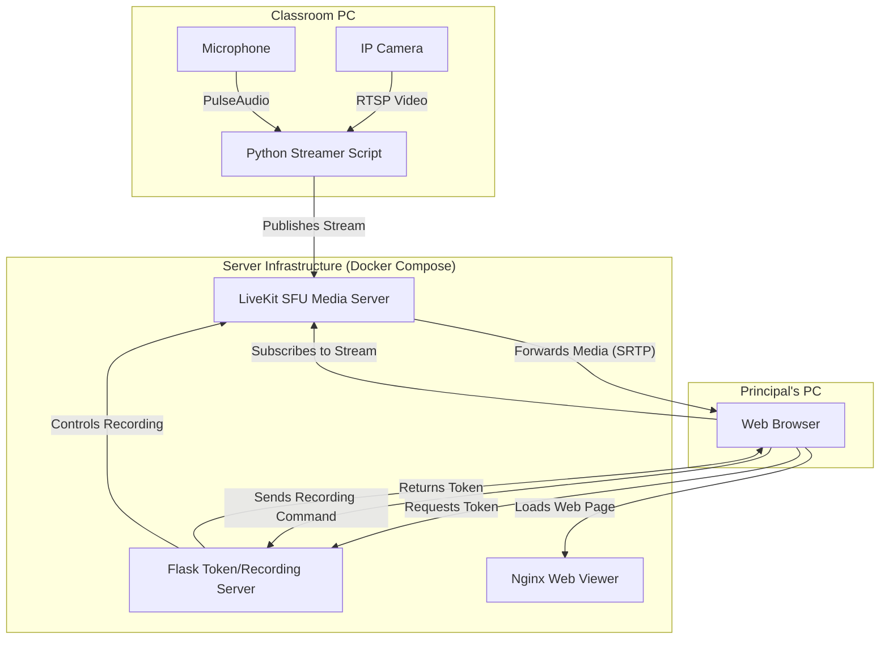
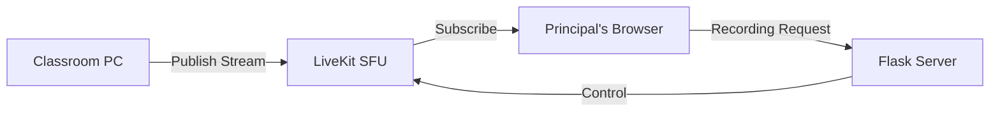

# WebRTC Classroom Streaming Platform

A professional-grade, reliable, and scalable real-time video monitoring system for multiple classrooms, built on LiveKit WebRTC infrastructure. This system enables educational institutions to efficiently monitor and record classroom activities with minimal latency and high reliability.



## Key Features

- 🎥 **Real-time Video/Audio Streaming**: Low-latency streaming from up to 26 classrooms simultaneously
- 🌐 **Centralized Viewer Dashboard**: Dynamic grid view for the Principal with on-demand stream loading
- ⚡ **Live Status Monitoring**: Real-time status indicators showing classroom connectivity
- 📹 **Dual Recording Options**:
  - Browser-based local recording
  - Server-side permanent recording
- 🚀 **Easy Deployment**: Docker-based deployment with automated setup scripts
- 🔧 **Production-Ready**: Built on LiveKit's professional WebRTC SFU

## System Architecture

### Components Overview

1. **Central Server**

   - LiveKit Media Server (SFU)
   - Flask-based Token/Recording Server
   - Redis for state management
   - Nginx serving the web viewer

2. **Classroom Streamer**

   - Python-based streaming client
   - RTSP camera integration
   - PulseAudio capture
   - Automatic reconnection handling

3. **Principal's Viewer**
   - Web-based dashboard
   - Dynamic grid layout
   - Real-time status monitoring
   - Recording controls

### Data Flow



## Features in Detail

### Live Status Monitoring

- Background connections to all rooms
- Real-time participant status tracking
- Green "LIVE" / Red "OFFLINE" indicators
- Zero video loading until needed

### On-Demand Viewing

- Click-to-view functionality
- Efficient resource usage
- Multiple simultaneous views supported
- Automatic cleanup on tab close

### Recording Capabilities

#### Local Recording

- Browser-based MediaRecorder implementation
- Direct download to Principal's computer
- WebM format with VP8 video and Opus audio
- No server storage required

#### Server Recording

- LiveKit Egress API integration
- MP4 format for compatibility
- Permanent storage on server
- Organized by classroom and timestamp

## Prerequisites

### Server Requirements

- Ubuntu 20.04 or newer
- Docker 20.10 or newer
- Docker Compose v2.0 or newer
- 4GB RAM minimum
- 50GB storage (for recordings)

### Classroom PC Requirements

- Ubuntu 20.04 Desktop or newer
- Docker 20.10 or newer
- Connected USB/Built-in microphone
- Network-accessible IP camera
- 2GB RAM minimum

## Deployment Guide

### Step 1: Clone the Repository

\`\`\`bash
git clone <your_repo_url>
cd classroom-streaming
\`\`\`

### Step 2: Server Setup

1. Configure environment variables:

   ```bash
   cd server
   cp .env.example .env
   ```

2. Edit the `.env` file:

   ```ini
   LIVEKIT_API_KEY=your_api_key_here
   LIVEKIT_API_SECRET=your_secret_here
   REDIS_PASSWORD=your_redis_password_here
   ```

3. Launch the server:

   ```bash
   docker-compose up -d --build
   ```

4. Verify the services:
   ```bash
   docker-compose ps
   ```

### Step 3: Classroom PC Setup

1. Configure environment variables:

   ```bash
   cd streamer
   cp .env.example .env
   ```

2. Edit the `.env` file:

   ```ini
   LIVEKIT_URL=ws://your_server_ip:7880
   LIVEKIT_API_KEY=your_api_key_here
   LIVEKIT_API_SECRET=your_secret_here
   ROOM_NAME=classroom101
   RTSP_URL=rtsp://camera_ip:554/stream
   MIC_DEVICE=default
   ```

3. Optional: Configure audio loopback for in-room monitoring:

   ```bash
   ./setup_loopback.sh
   ```

4. Build and run the streamer:
   ```bash
   docker build -t classroom-streamer .
   docker run -d \
     --name classroom-streamer \
     --restart unless-stopped \
     --device /dev/snd \
     -v /etc/localtime:/etc/localtime:ro \
     --env-file .env \
     classroom-streamer
   ```

### Step 4: Access the Viewer

1. Open a web browser and navigate to:

   ```
   http://your_server_ip
   ```

2. You should see the grid of classrooms with their live status indicators.

## Development Setup

For developers who want to modify or extend the platform:

1. Install development dependencies:

   ```bash
   # Token Server
   cd token_server
   python -m venv venv
   source venv/bin/activate
   pip install -r requirements.txt

   # Viewer
   cd ../viewer
   npm install
   ```

2. Start development servers:

   ```bash
   # Token Server
   cd token_server
   python app.py

   # Viewer
   cd viewer
   npm run dev
   ```

## Configuration Options

### LiveKit Server (`livekit.yaml`)

```yaml
port: 7880
rtc:
  port: 7881
  use_external_ip: true
room:
  enabled: true
  max_participants: 50
```

### Token Server

- `LIVEKIT_API_KEY`: API key for LiveKit authentication
- `LIVEKIT_API_SECRET`: API secret for LiveKit authentication
- `RECORDINGS_DIR`: Directory for server-side recordings

### Streamer

- `ROOM_NAME`: Unique classroom identifier
- `RTSP_URL`: IP camera stream URL
- `MIC_DEVICE`: PulseAudio device name

## Troubleshooting

### Common Issues

1. **Streamer Won't Connect**

   - Check network connectivity
   - Verify API key/secret
   - Ensure camera URL is accessible

2. **No Audio in Stream**

   - Check microphone permissions
   - Verify PulseAudio configuration
   - Run `setup_loopback.sh` again

3. **Recording Issues**
   - Check disk space
   - Verify write permissions
   - Check LiveKit logs

## Future Work (Version 2.0)

Planned features for the next major release:

- 📺 **Live Rewind**: DVR capability for instant replay
- 💾 **Network Storage**: NAS integration for recordings
- 📊 **Analytics Dashboard**: Classroom usage statistics
- 🔔 **Alert System**: Automated notifications
- 🎛️ **Admin Panel**: Advanced configuration UI

## Contributing

We welcome contributions! Please see our [Contributing Guide](CONTRIBUTING.md) for details.

## License

This project is licensed under the MIT License - see the [LICENSE](LICENSE) file for details.

## Acknowledgments

- [LiveKit](https://livekit.io) for the WebRTC infrastructure
- [Flask](https://flask.palletsprojects.com/) for the token server
- [Docker](https://www.docker.com) for containerization
